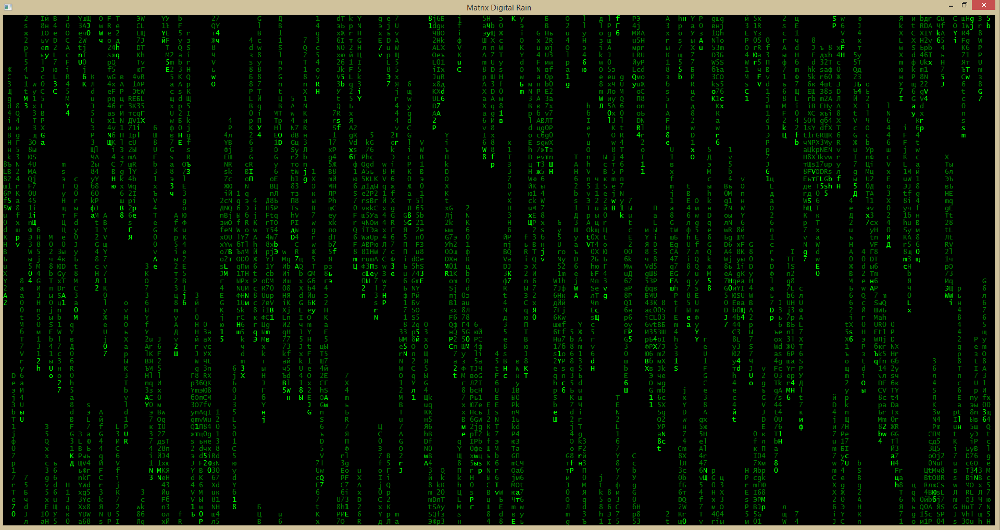

# Matrix
Matrix Digital Rain effect Visual Studio 2015.

* Creates the Digital Rain effect on the command console.
* Uses alphanumerics and the cyrillic alphabet.
* Forked from [Programgood.net](http://www.programgood.net/2009/02/25/MatrixRainEffectInCConsoleApp.aspx)
 
 

